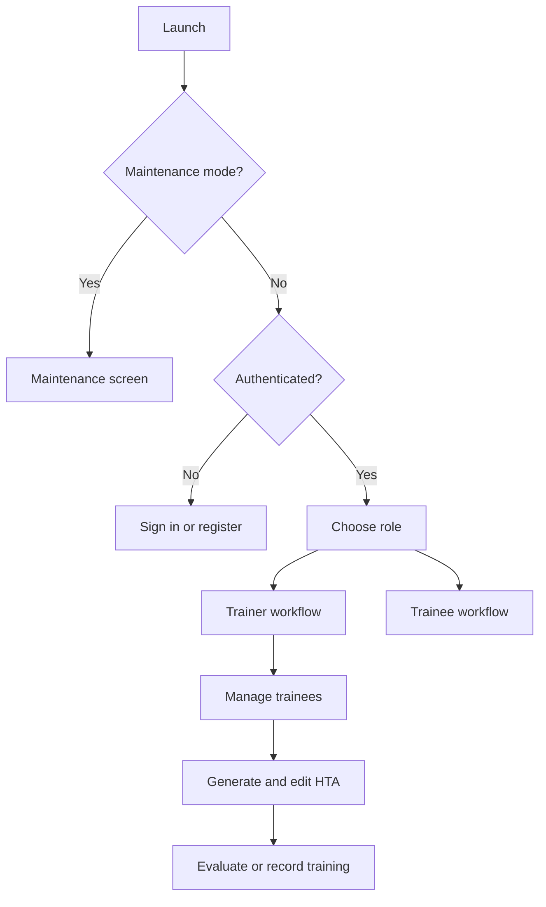

<div align="center">
  
  <h1>Employ210</h1>
  <p><strong>Human-centered task analysis and workforce training for iOS.</strong></p>
  <p>
    Employ210 helps practitioners turn a task description, supporting instructions, and expert clarification into an editable hierarchical task analysis (HTA), then use that HTA to guide and evaluate training.
  </p>
</div>

## Overview

Employ210 is a SwiftUI application for creating and managing individualized workforce-training programs. A trainer can organize trainees, generate an HTA through a two-phase clarification workflow, revise the generated steps, save the result, evaluate task performance, export a program as a PDF, and record or upload training video.

The application currently combines:

- a native iOS interface built with SwiftUI;
- authentication and role metadata through Amazon Cognito;
- HTA generation through an AWS Lambda Function URL;
- HTA and video storage in Amazon S3;
- lightweight on-device persistence for trainers, trainees, programs, and evaluations; and
- a remote maintenance flag for temporarily placing the app in maintenance mode.

> [!IMPORTANT]
> This repository contains the iOS client and Amplify backend definition, but not the deployed Lambda implementation or environment-specific Amplify configuration. Access to the corresponding AWS environment is required for the complete workflow.

## Current capabilities

### Accounts and navigation

- Email/password registration, verification, sign-in, and password reset
- Cognito-backed session restoration and sign-out
- Member, trainer, and admin role metadata
- Trainer and trainee entry points
- Optional folder selection for grouping HTA sessions
- Remotely controlled maintenance screen

### HTA generation

- Free-text task descriptions
- Optional SOP, policy, and safety context entered manually or extracted from a PDF
- Two-phase API flow:
  1. request targeted clarification questions;
  2. submit answers and generate the final HTA
- High-level steps, low-level steps, observations, duration, and compliance checks
- In-app editing, reordering, addition, and deletion of generated steps
- S3 persistence and Lambda-backed HTA history

### Training and evaluation

- Trainer and trainee organization
- Saved training programs per trainee
- Step-level ratings: pass, needs prompting, not completed, or pending
- Session timer and evaluation history
- PDF export and iOS share sheet
- Camera recording or video selection followed by S3 upload

## Application flow



## Technology

| Area | Implementation |
| --- | --- |
| UI | SwiftUI |
| Language | Swift 5 |
| Minimum app target | iOS 18.5 |
| Authentication | AWS Amplify + Amazon Cognito |
| Cloud storage | Amazon S3 through Amplify Storage |
| HTA service | AWS Lambda Function URL |
| Animation | Lottie |
| Local persistence | `UserDefaults` with `Codable` models |
| Documents and media | PDFKit, AVFoundation, PhotosUI |

## Requirements

- macOS with Xcode 16.4 or newer
- An Apple development team for device signing
- Access to the Employ210 AWS Amplify environment
- The deployed HTA Lambda service, or a compatible replacement
- A physical iPhone for camera testing; most other screens can be exercised in the simulator

The Swift packages used by the application target are resolved by Xcode:

- [Amplify Swift](https://github.com/aws-amplify/amplify-swift)
- [Lottie for iOS](https://github.com/airbnb/lottie-ios)

## Getting started

1. Clone the repository and enter the project directory.

   ```bash
   git clone <repository-url>
   cd Employ210
   ```

2. Obtain the AWS environment configuration from a project maintainer. The Xcode project expects these generated files at the repository root:

   ```text
   amplifyconfiguration.json
   awsconfiguration.json
   ```

   They are intentionally excluded from version control. If you have access to the Amplify project, you can recreate them with the Amplify CLI using the app ID and environment name supplied by the maintainer.

3. Review the service configuration in `Employ210/HTAGeneratorView.swift`:

   - `AWSConfig.lambdaURL`
   - `AWSConfig.statusURL`
   - `AWSConfig.s3BucketName`
   - `AWSConfig.s3Region`

   For a new deployment, replace these values with endpoints and resources owned by that environment. Do not commit credentials or private infrastructure metadata.

4. Open the Xcode project.

   ```bash
   open Employ210.xcodeproj
   ```

5. In Xcode:

   - allow Swift Package Manager to resolve dependencies;
   - select the `Employ210` target;
   - choose your development team under **Signing & Capabilities**;
   - update the bundle identifier if required; and
   - build and run on a simulator or connected device.

## Backend contract

The client sends JSON `POST` requests to the URL in `AWSConfig.lambdaURL`. A compatible service should support the following phases.

| Phase | Purpose | Principal fields |
| --- | --- | --- |
| `clarify` | Start a generation session and request missing information | `query`, optional `custom_instructions`, optional `folder` |
| `run` | Generate an HTA after clarification | `session_id`, optional answer map |
| `list_htas` | Retrieve saved HTA summaries | `folder` |

The generated HTA may include:

```json
{
  "duration_sec": 180,
  "high_level_steps": ["Prepare the workspace"],
  "low_level_steps": ["Collect the required materials"],
  "observations": ["The workspace is clear and safe"],
  "compliance_checklist": [
    {
      "rule": "Required PPE is used",
      "satisfied": true,
      "note": null
    }
  ]
}
```

See the request and response models near the beginning of `Employ210/HTAGeneratorView.swift` for the complete client-side schema.

## Data and storage

Employ210 uses both local and cloud storage.

| Data | Current location |
| --- | --- |
| Authentication and role attributes | Amazon Cognito |
| Generated HTA files | Amazon S3 / HTA service |
| Training videos | Amazon S3 |
| Trainers and trainees | On-device `UserDefaults` |
| Saved trainee programs | On-device `UserDefaults` |
| Evaluation sessions | On-device `UserDefaults` (most recent 50) |
| Recording metadata | On-device `UserDefaults` (most recent 100) |

Local records are not currently synchronized between devices. Treat the existing persistence layer as prototype storage rather than a production clinical or educational record system.

## Project structure

```text
Employ210/
├── Employ210.xcodeproj/            Xcode project and Swift package references
├── Employ210/
│   ├── Employ210App.swift          Application entry point and Amplify setup
│   ├── AuthenticationManager.swift Cognito authentication lifecycle
│   ├── RootCoordinator.swift       Authentication and maintenance routing
│   ├── HTAGeneratorView.swift      Clarification, generation, editing, and S3 save
│   ├── InstructionsInputView.swift Typed/PDF supporting instructions
│   ├── HTAHistoryView.swift        Lambda-backed generation history
│   ├── TrainerHomeView.swift       Trainer dashboard
│   ├── TrainerDetailView.swift     Trainer-to-trainee management
│   ├── TraineeDetailView.swift     Programs, evaluations, PDF, and video workflow
│   ├── SavedHTAProgram.swift       Saved program model and local store
│   └── traineestore.swift          Trainer/trainee models and local store
├── Employ210Tests/                 Swift Testing target
├── amplify/                        Amplify Gen 1 backend definition
└── status.json                     Example maintenance-mode response
```

## Research direction: adaptive human-in-the-loop learning

The current app asks clarification questions and supports expert revision. The planned research direction is to turn those interactions into an explicit learning loop rather than treating expert review as a one-time gate.

The central distinction is between:

- **documented omissions**: steps present in an SOP but missing from a generated HTA; and
- **tacit omissions**: steps known by the expert but absent from the source material.

The proposed system would log which question surfaced which knowledge, which steps an expert added or removed, and how much expert time each stage consumed. That instrumentation would support research on budgeted review and elicitation, adaptive question selection, improvement across deployment episodes, and calibrated reporting of residual omission risk.

This section describes the project direction, not functionality already completed in this repository.

## Development status

This is an active research prototype. Before production deployment, the project still needs:

- meaningful unit, integration, and UI test coverage;
- server-side authorization for every Lambda operation;
- migration of environment-specific endpoints out of source code;
- durable synchronized storage for trainer, trainee, program, and evaluation records;
- privacy, retention, consent, and deletion policies for video and participant data;
- accessibility and device-matrix validation; and
- removal or completion of placeholder trainee-facing screens.

## Testing

Run the test target from Xcode with **Product → Test**, or from the command line on macOS:

```bash
xcodebuild test \
  -project Employ210.xcodeproj \
  -scheme Employ210 \
  -destination 'platform=iOS Simulator,name=iPhone 16 Pro'
```

The current test target contains only the generated placeholder test. Contributions that add coverage around API decoding, persistence, editing, and authentication state transitions are especially valuable.

## Security and privacy notes

- Never commit Amplify-generated environment files, credentials, access keys, or participant data.
- Review S3 access levels before collecting real recordings. The current client writes recordings beneath a `public/` key prefix.
- The client currently checks authentication before generation, but the backend must independently authenticate and authorize every request.
- Do not use real participant or health-related data until institutional, legal, and security requirements have been reviewed.

## Contributing

1. Create a focused branch from the current development branch.
2. Keep environment-specific values and generated AWS configuration out of commits.
3. Add or update tests for behavior changes.
4. Verify the app on the simulator and, for media features, a physical device.
5. Open a pull request describing the user-facing change, backend assumptions, and validation performed.

## License

No license file is currently included. Until a license is added, all rights remain with the repository owner and external reuse is not granted by default.
